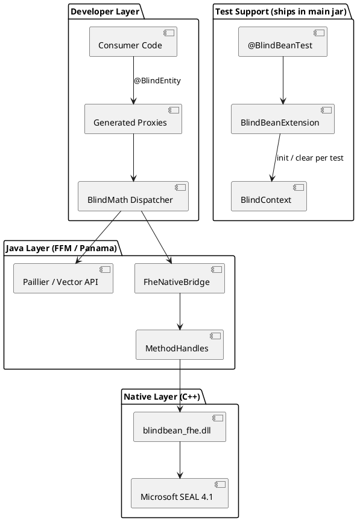
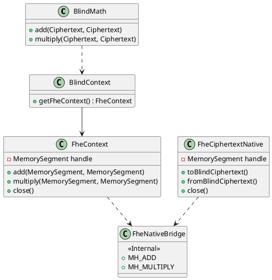
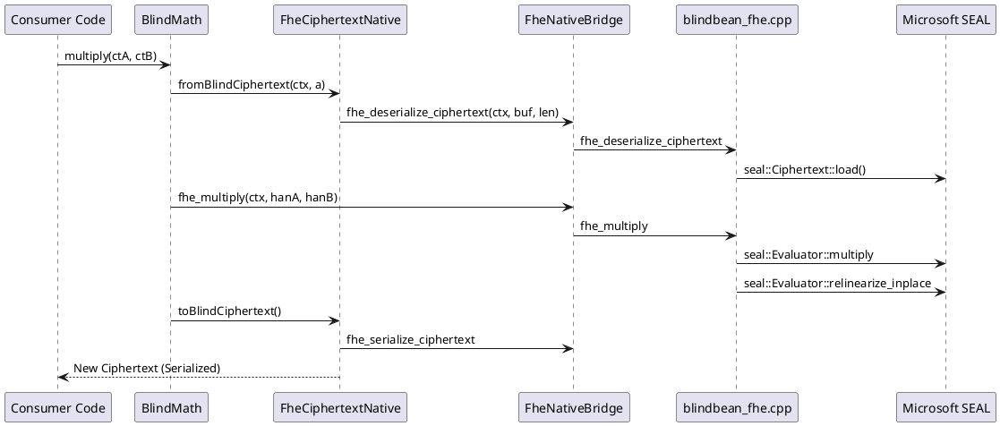

# Architecture: BlindBean

BlindBean is structurally tiered into three layers to maintain high Developer Experience (DX) without compromising crypto-performance. This document details the relationship between the Java application layer and the native Microsoft SEAL backend.

## Architecture Overview




> The rendered PNG above predates the Test Support package; the PlantUML source is authoritative.

---

## 1. The Developer Layer (Annotations & Proxies)

At compile time, `HomomorphicProcessor` evaluates classes annotated with `@BlindEntity`. It automatically generates heavily optimized wrapper proxies (e.g., `UserAccountBlindWrapper`).
- **No Reflection**: By generating source code rather than using runtime weaving or reflection APIs, we avoid runtime performance hits.
- **Transparent Invocation**: When the developer calls `wrapper.addBalance(amount)`, the proxy manages the complexity of extracting the ciphertext, executing homomorphic math, and re-setting the ciphertext.
- **Explicit Type Binding**: Using AST `TypeMirrors`, the processor resolves the declared plaintext type via `type()` and emits the encode/decode for it. Every supported type is reduced to something a scheme can physically hold — an integer for Paillier, a slot vector for BFV/CKKS:

  | Type | Scheme | Encoding |
  |:-----|:-------|:---------|
  | `byte`/`short`/`int`/`long`/`BigInteger` (+ boxed) | PAILLIER | `BigInteger.valueOf` |
  | `BigDecimal` | PAILLIER | unscaled integer at a fixed `scale()` |
  | `String` | PAILLIER | UTF-8 bytes as an unsigned magnitude |
  | `byte[]` | PAILLIER | bytes behind a `0x01` marker (a `BigInteger` drops leading zeros) |
  | `boolean` | PAILLIER | 0 / 1 |
  | `Instant`, `LocalDate`, `Duration` | PAILLIER | epoch millis / epoch day / millis |
  | `float`/`double` (+ boxed), `float[]`, `double[]` | CKKS | scalar / slot vector |
  | `long[]`, `int[]`, `short[]` | BFV | slot vector |

- **Algebraic boundaries are enforced structurally**: arithmetic is *not generated* where it would be meaningless or destructive. Adding two UTF-8 encodings or two blobs corrupts them; adding two `Instant`s ("Tuesday plus Thursday") is not a date. A `Duration` is a quantity, so it adds. Paillier gets no `mul` — it is additively homomorphic only.

- **Signed decoding**: Paillier's plaintext space is Z_n, so a raw `decrypt` returns a residue and `encrypt(-5)` comes back as `n - 5`. Every *numeric* decode the processor emits goes through `PaillierMath.decryptSigned` (balanced representation). `String` and `byte[]` keep the unsigned `decrypt` — they are magnitudes, and a blob with its top bit set would otherwise read as negative.

- **Composition (`@BlindNested`)**: a field whose type is itself a `@BlindEntity` gets an accessor returning that entity's wrapper (`order.customer().subBalance(...)`), writing through to the same object. Explicit by design — the processor does not hunt for `@BlindEntity`-typed fields on its own.

- **Records are unsupported by construction**: the wrapper stores each ciphertext with `entity.setX(hex)`, and a record's components are final. Supporting them would require a different, value-returning generated API.

---

## 2. The Native Layer (FHE & Microsoft SEAL)

For Fully Homomorphic Encryption (FHE) like BFV or CKKS, we bridge to **Microsoft SEAL 4.1** via a C++ backend and Project Panama.

### Class Relationship




### Operation Sequence (FHE Multiplication)




---

## 3. Implementation Details

### FFM (Project Panama) Integration

We utilize the Java 26 **Foreign Function & Memory API** (`java.lang.foreign`) for zero-overhead native calls.

- **`MethodHandle` Downcalls**: Every native symbol is resolved once at class-load time via `SymbolLookup.loaderLookup()` into a `MethodHandle` static. Any new native call follows the same pattern.
- **Struct Opaque Handles**: Java only ever sees a `MemorySegment` (an opaque `void*`). All SEAL-specific state is managed within a `BlindBeanContext` struct on the C++ heap.
- **Critical Exports**: On Windows, we use `__declspec(dllexport)` and `extern "C"` to ensure stable, discoverable symbols.

#### Batching and introspection symbols

| Symbol | Purpose |
|:-------|:--------|
| `fhe_encrypt_long_array` / `fhe_decrypt_long_array` | BFV slot vector (`seal::BatchEncoder`) |
| `fhe_encrypt_double_array` / `fhe_decrypt_double_array` | CKKS slot vector (`seal::CKKSEncoder`) |
| `fhe_plain_modulus` | BFV plaintext modulus `t`; 0 for CKKS. **Java needs it to reject unencodable values** — see below |
| `fhe_slot_count` | `polyModulusDegree` for BFV, half that for CKKS |

CKKS only ever had the scalar path (`fhe_encrypt_double`), so every ciphertext wasted all but one of its `degree/2` slots, and a CKKS key rotation — which round-trips through decrypt/encrypt — could carry only slot 0. The array symbols close that.

### Scheme Specifics & Security

We target **128-bit security** based on the parameters recommended by the HomomorphicEncryption.org standard. (That figure describes *these parameters*. It says nothing about the Paillier modulus, which the caller sizes — see `SECURITY-AND-LIMITATIONS.md`.)

| Parameter | BFV (Exact) | CKKS (Approximate) |
|:----------|:------------|:-------------------|
| **Poly Modulus Degree** | 8192 | 8192 |
| **Coeff Modulus** | `BFVDefault` | `{60, 40, 40, 60}` |
| **Plain Modulus** | `Batching(8192, 20)` → t = 1,032,193 | N/A |
| **Scale** | N/A | 2^40 |
| **Batching slots** | 8192 | **4096** (degree/2) |
| **Usable slot range** | **±516,096** | real, approximate |

- **BFV**: Exact integer arithmetic; auto-relinearizes after multiplication. `seal::BatchEncoder` maps a Java `long[]` (or `int[]`/`short[]`, widened) across the FFM boundary into one polynomial for SIMD-style operation.

  **A slot is not a `long`.** `t` is 20-bit, so a slot holds only ±516,096. SEAL's encoder reduces anything larger **mod t without complaint** — 1,000,000 decrypted as -32,193 — and a single out-of-range entry corrupted *every other slot in the vector*. `FheContext.encryptLongArray` therefore range-checks against `maxSlotValue()` (derived from `fhe_plain_modulus`) and throws rather than encrypting a value it cannot represent. Widening the range means raising the plaintext modulus, at the cost of noise budget.

- **CKKS**: Approximate real arithmetic; auto-relinearizes and rescales to manage depth. Packs `degree/2` reals per ciphertext (complex-conjugate symmetry). **Never use it for money** — `BigDecimal` on Paillier is the exact option.

### Memory & Lifecycle Management

- **Deterministic Cleanup**: Native resources are tied to Java `AutoCloseable` wrappers. We strictly follow the `try-with-resources` pattern to prevent memory leaks in the native heap.
- **Static DLL**: The native library is built as a self-contained DLL (`x64-windows-static`). It bundles Microsoft SEAL and the C Runtime (CRT), requiring zero external dependencies on the host machine.

### Native Load Diagnostics

`FheContext.bfv()` / `ckks()` do not call the bridge directly — they route through the package-private `initNative(Supplier<MemorySegment>)` helper. It catches linkage failures (`UnsatisfiedLinkError`, `ExceptionInInitializerError`, `NoClassDefFoundError`) and rethrows an `FheException` whose message is built by `nativeLoadGuidance()`: detected OS/arch, whether `blindbean.native.path` was set and what it pointed at, the exact `-D` flag to pass, the Windows `Release/` subdirectory caveat, the one-time CMake command, and the original error as the cause.

This exists because the missing-library failure is the first error most new users ever see. Any future native entry point should be created through the same helper so that property stays true.

---

## 3.5 Test Support Layer (`se.deversity.blindbean.junit`)

Ships in the **main** artifact — `junit-jupiter-api` is therefore scoped `provided`, so consumers inherit the extension with the library while supplying their own JUnit at runtime.

| Type | Role |
|:-----|:-----|
| `@BlindBeanTest` | Class-level annotation. Attributes: `scheme` (default `PAILLIER`), `polyModulusDegree` (8192), `ckksScale` (2^40). |
| `BlindBeanExtension` | `BeforeEachCallback` / `AfterEachCallback`. Calls `BlindContext.init()` before each test, plus `initBfv`/`initCkks` when the annotation requests a native scheme, and `BlindContext.clear()` afterwards. |

The extension resolves its configuration by walking parent `ExtensionContext`s, so `@Nested` classes inherit the enclosing class's annotation. Applying `@ExtendWith(BlindBeanExtension.class)` without the annotation yields the Paillier defaults.

Consequence for tests: no `@BeforeEach BlindContext.init()` / `@AfterEach clear()` boilerplate, and no key or native-handle leakage between test methods.

---

## 4. Build System

The native registry uses **CMake** and **vcpkg** (Manifest Mode):

```powershell
# Build native bridge
cmake -S src/main/native -B build-native `
    -DCMAKE_TOOLCHAIN_FILE="vcpkg/scripts/buildsystems/vcpkg.cmake" `
    -DVCPKG_TARGET_TRIPLET=x64-windows-static
cmake --build build-native --config Release
```

The resulting library is linked at runtime via `-Dblindbean.native.path=build-native/Release`.
