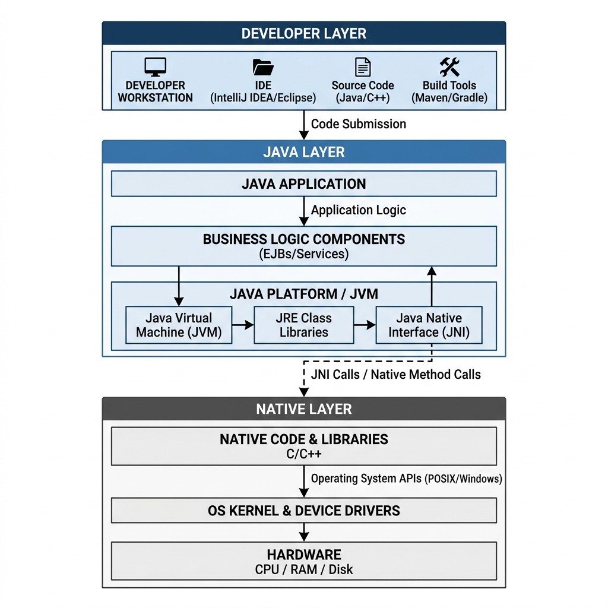
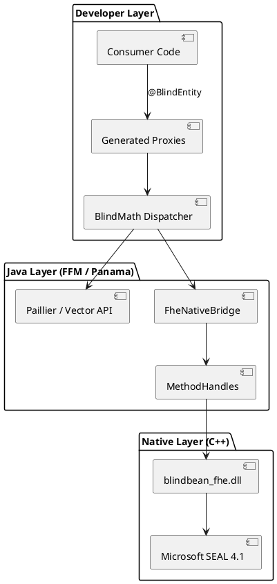
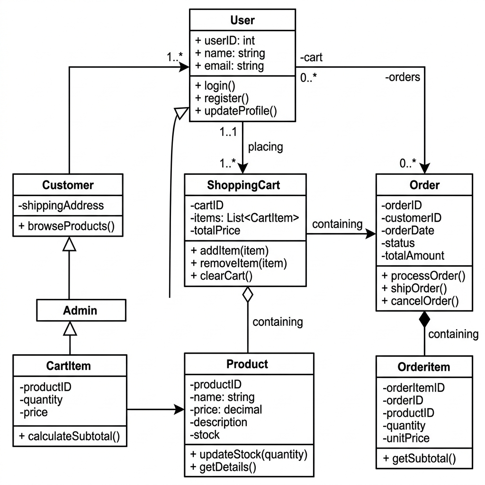
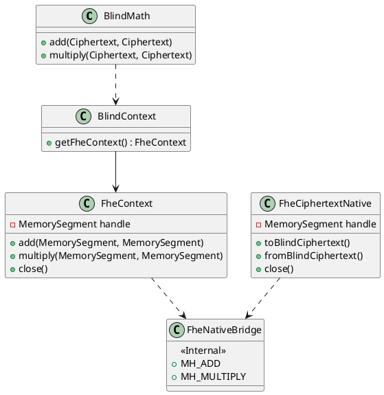
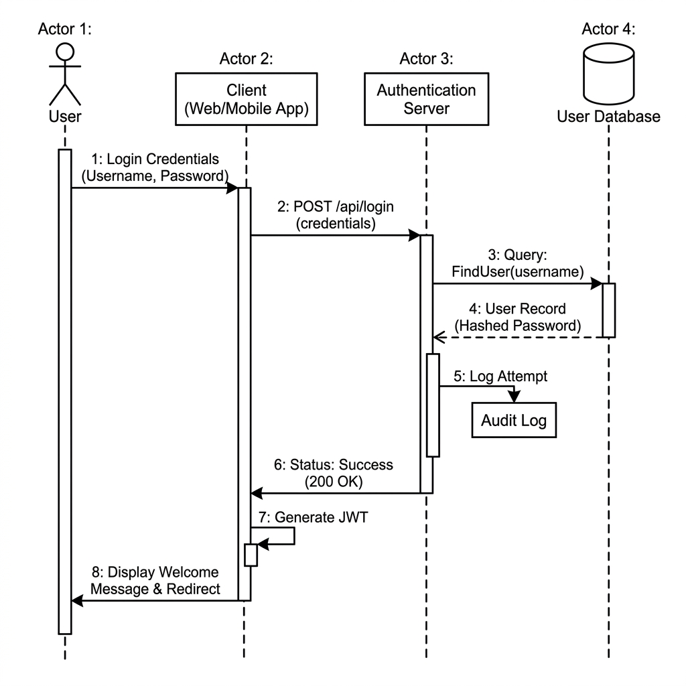
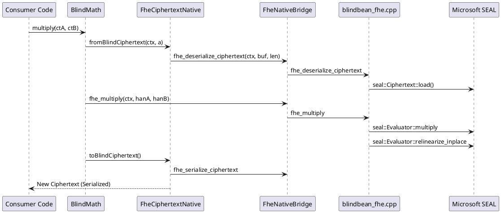

# Architecture: BlindBean

BlindBean is structurally tiered into three layers to maintain high Developer Experience (DX) without compromising crypto-performance. This document details the relationship between the Java application layer and the native Microsoft SEAL backend.

## Architecture Overview





---

## 1. The Developer Layer (Annotations & Proxies)

At compile time, `HomomorphicProcessor` evaluates classes annotated with `@BlindEntity`. It automatically generates heavily optimized wrapper proxies (e.g., `UserAccountBlindWrapper`).
- **No Reflection**: By generating source code rather than using runtime weaving or reflection APIs, we avoid runtime performance hits.
- **Transparent Invocation**: When the developer calls `wrapper.addBalance(amount)`, the proxy manages the complexity of extracting the ciphertext, executing homomorphic math, and re-setting the ciphertext.

---

## 2. The Native Layer (FHE & Microsoft SEAL)

For Fully Homomorphic Encryption (FHE) like BFV or CKKS, we bridge to **Microsoft SEAL 4.1** via a C++ backend and Project Panama.

### Class Relationship





### Operation Sequence (FHE Multiplication)





---

## 3. Implementation Details

### FFM (Project Panama) Integration

We utilize the Java 26 **Foreign Function & Memory API** (`java.lang.foreign`) for zero-overhead native calls.

- **`MethodHandle` Downcalls**: All 15 native symbols are resolved once at class-load time via `SymbolLookup.loaderLookup()`.
- **Struct Opaque Handles**: Java only ever sees a `MemorySegment` (an opaque `void*`). All SEAL-specific state is managed within a `BlindBeanContext` struct on the C++ heap.
- **Critical Exports**: On Windows, we use `__declspec(dllexport)` and `extern "C"` to ensure stable, discoverable symbols.

### Scheme Specifics & Security

We target **128-bit security** based on the parameters recommended by the HomomorphicEncryption.org standard.

| Parameter | BFV (Exact) | CKKS (Approximate) |
|:----------|:------------|:-------------------|
| **Poly Modulus Degree** | 8192 | 8192 |
| **Coeff Modulus** | `BFVDefault` | `{60, 40, 40, 60}` |
| **Plain Modulus** | `Batching(8192, 20)` | N/A |
| **Scale** | N/A | 2^40 |

- **BFV**: Used for exact integer arithmetic. Automatically relinearizes after multiplication.
- **CKKS**: Used for floating-point arithmetic. Automatically relinearizes and rescales to manage depth.

### Memory & Lifecycle Management

- **Deterministic Cleanup**: Native resources are tied to Java `AutoCloseable` wrappers. We strictly follow the `try-with-resources` pattern to prevent memory leaks in the native heap.
- **Static DLL**: The native library is built as a self-contained DLL (`x64-windows-static`). It bundles Microsoft SEAL and the C Runtime (CRT), requiring zero external dependencies on the host machine.

---

## 4. Build System

The native registry uses **CMake** and **vcpkg** (Manifest Mode):

```powershell
# Build native bridge
cmake -S src/main/native -B build-native `
    -DCMAKE_TOOLCHAIN_FILE="vcpkg/scripts/buildsystems/vcpkg.cmake" `
    -DVCPKG_TARGET_TRIPLET=x64-windows-static
cmake --build build-native --config Release
```

The resulting library is linked at runtime via `-Dblindbean.native.path=build-native/Release`.
