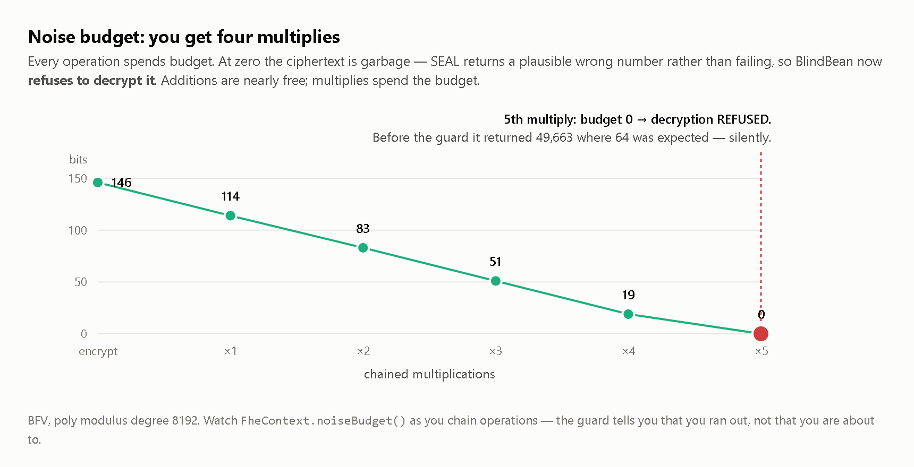
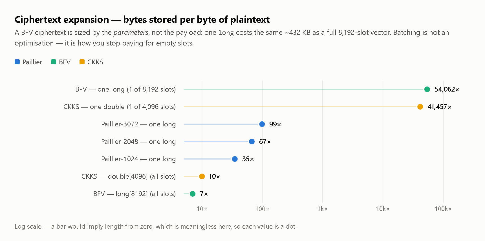
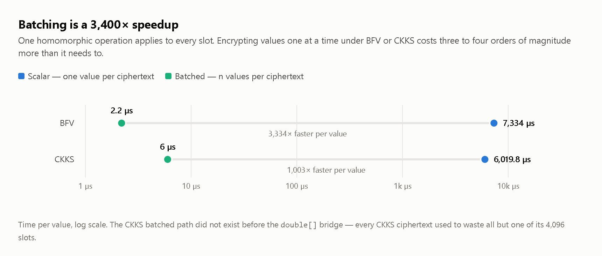
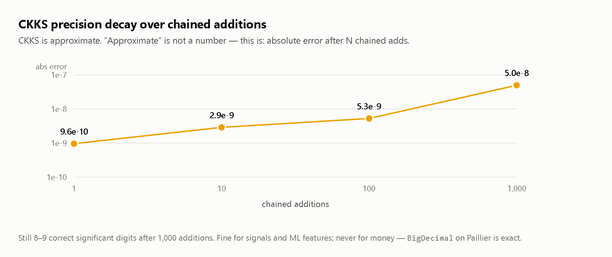
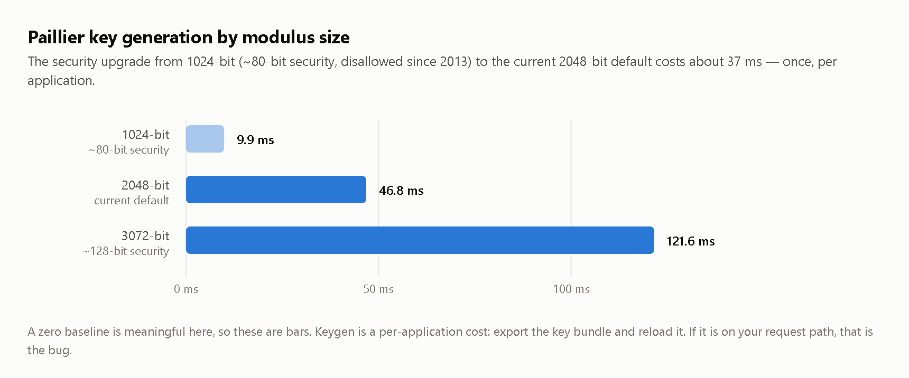

# BlindBean Load Tests

Standalone harness — **not** a module of the core reactor, so an ordinary `mvn install` never pays
for it (same arrangement as `vibetags/load-tests`).

| Category | Class | What it measures |
|---|---|---|
| Crypto metrics | `CryptoMetricsTest` | Ciphertext expansion, noise budget → multiplicative depth, CKKS precision decay, batching amortisation, keygen cost by modulus size |
| Concurrency & leaks | `ConcurrentCryptoStressTest` | Thread-local key isolation under 32 virtual threads, foreign-key rejection under load, native-handle lifecycle over thousands of ops |
| Hot-path microbenchmarks | `CryptoHotPathBenchmark` (JMH) | Per-operation cost of encrypt/decrypt/add/multiply across Paillier, BFV and CKKS, plus batched ops |

Throughput alone tells you almost nothing about a homomorphic library. The numbers that decide
whether a design is *viable* are cryptographic: how much your data swells, and how many operations
you can chain before it silently turns to noise. Those are what this harness reports.

## Prerequisite

Install the library into your local repo first:

```bash
cd .. && ./mvnw install -DskipTests -Dblindbean.native.path=build-native/Release
```

FHE sweeps are **skipped, not failed**, when the native library is absent — the Paillier metrics
still run.

## Running

```bash
cd load-tests

# Everything (~2 min)
../mvnw test

# Keep a CI run quick
../mvnw test -Dstress.max.ops=100

# JMH microbenchmarks
../mvnw package -DskipTests
java --enable-preview --add-modules jdk.incubator.vector --enable-native-access=ALL-UNNAMED \
     -Dblindbean.native.path=../build-native/Release \
     -jar target/benchmarks.jar -wi 3 -i 5 -f 1 -tu us -bm avgt -prof gc \
     -rf json -rff results/0.1.0/jmh.json
```

Reports land in `target/*.txt` and print to stdout. Copy them into `results/<version>/` when a
release is cut, so a regression is a diff.

## In CI

A **small-load regression gate** runs on every push (Windows job, ~10 s at `-Dstress.max.ops=50`).
It is a gate, not a benchmark — timings on a shared runner are noise, so it asserts *properties*:

- BFV keeps its **multiplicative depth ≥ 4** — a SEAL upgrade or parameter tweak that quietly costs
  a multiply would otherwise ship unnoticed, and every user relying on four would start getting
  silent garbage.
- **Batched expansion stays in single digits** — catches a batch path that has stopped filling slots.
- **No thread reads back a value it did not write**, and no foreign ciphertext decrypts.
- The batching-speedup gate only applies at a realistic batch size: a batched ciphertext costs the
  same fixed ~432 KB whether it carries 50 values or 4,096, so the per-value win *legitimately*
  collapses under a small load (40× at n=50). Asserting there would make the gate permanently red
  for the very reason the chart below explains.

The full sweep — the figures and charts here — is a local or release-time run.

## What 0.1.0 says — and what you should do about it

Full numbers in [`results/0.1.0/`](results/0.1.0/), charts in
[`results/0.1.0/charts/`](results/0.1.0/charts/).

### 1. You get **four** multiplies. Then your data is silently wrong.



The single most important number in the file. At the default parameters BFV survives **four chained
multiplications**. On the fifth the budget hits zero and decryption returns a plausible wrong number
— **no exception, no warning**. Additions are nearly free; multiplies spend the budget.

An application that chains multiplies must watch `FheContext.noiseBudget()`. Nothing else will tell
it the answer has gone wrong.

### 2. A single BFV value costs 54,000× its plaintext



A BFV ciphertext is sized by the *parameters*, not the payload. If your entity holds a single `long`
under BFV you have picked the worst cell in that chart — and the annotation API makes it the
*easiest* thing to write. Use Paillier (67×), or fill the slots.

### 3. Batching is a 3,400× speedup, and CKKS only just got it



The CKKS batched path did not exist before the `double[]` bridge — every CKKS ciphertext used to
waste all but one of its 4,096 slots.

### 4. CKKS holds ~8–9 correct digits over 1,000 additions



Fine for signals and ML features. **Never** for money — `BigDecimal` on Paillier is exact.

### Keygen (per application, not per request)



If keygen is on your request path, that's the bug — export the key bundle and reload it.

### Per-operation costs — two counter-intuitive results

Paillier-2048, µs/op ([`results/0.1.0/jmh-paillier.txt`](results/0.1.0/jmh-paillier.txt)):

| Operation | Cost |
|---|---|
| `add` | **24 µs** |
| `subtract` | **558 µs** |
| `encrypt` | **8,107 µs** |
| `decrypt` | **8,051 µs** |

**Subtraction costs 23× an addition.** Addition is a modular multiply; subtraction is a multiply by
the modular *inverse*. They are not symmetric, and a loop that subtracts is not a loop that adds.

**Encryption dominates everything** — ~330× an add. So every *plaintext* overload (`addX(5)`,
`subX(5)`) silently pays a full encryption. In a loop, encrypt once and pass the `Ciphertext`
overload instead.

A hypothesis this disproved: `subX(plain)` could skip the inverse by encrypting the negation and
adding. It buys ~2%, inside the error bars — the inverse was never the bottleneck. The benchmark is
kept so nobody re-proposes it.

### Concurrency

32 virtual threads × 500 ops: **zero** key bleed, **zero** foreign ciphertexts silently decrypted
(800/800 correctly refused), and no heap growth across 2,000 native round-trips. `BlindContext` is
thread-local and `getPaillier()` silently mints a *fresh key* on a thread that has none — so a
leak here would produce unreadable ciphertexts rather than an exception. The only assertion that
catches that is "every worker reads back exactly what it wrote", which is what the test does.
